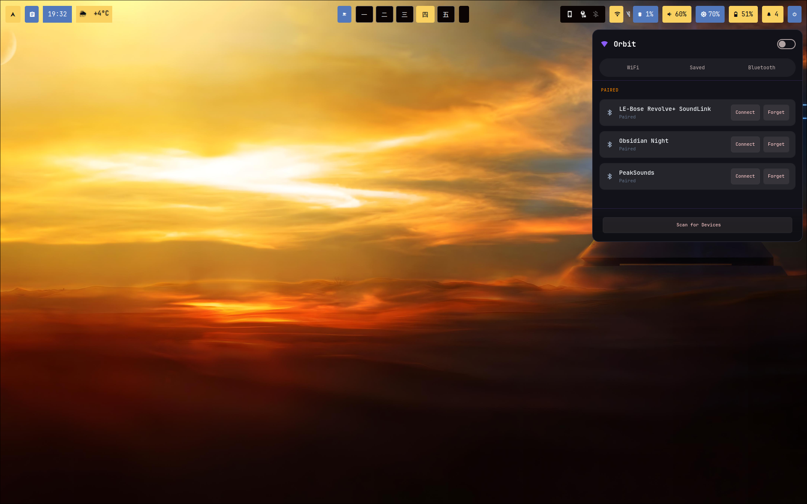
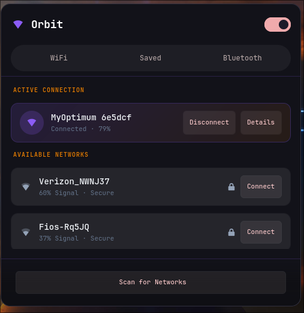
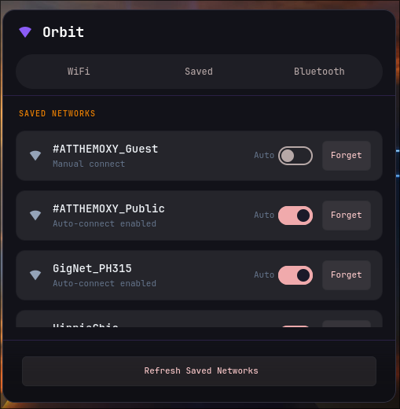
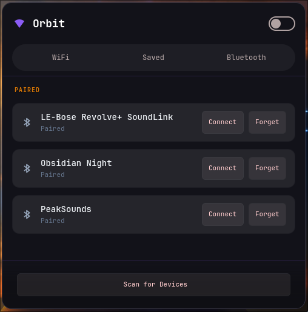

# Orbit - WiFi/Bluetooth Manager for Wayland

A native WiFi/Bluetooth manager for Wayland using Rust, GTK4, and layer-shell with a high-contrast glassmorphism UI.

## Interface Preview

<p align="center">
  
</p>

<p align="center">
  
  
  
</p>

## Features

- **WiFi Management**
  - Scan and list available networks with GTK signal strength icons
  - Connect to open and secured networks (WPA2/WPA3 support)
  - Disconnect from active networks
  - Saved networks tab with autoconnect toggles and forget functionality
  - Detailed network information (IP, Gateway, DNS, MAC, Speed)
- **Bluetooth Management**
  - Scan for nearby devices with device-type specific icons
  - Pair, connect, disconnect, and remove/forget devices
  - Clean separation of Connected, Paired, and Available devices
- **Modern UI/UX**
  - **High-Contrast Glassmorphism**: High-quality translucent panels with customizable opacity.
  - **Smooth Transitions**: Animated slide-up overlays for passwords, details, and errors.
  - **Dynamic Positioning**: Can be anchored to any corner or center edge via CLI.
  - **Keyboard Friendly**: `Escape` key support to close overlays or hide the window.
- **Theme Synchronization**
  - **Hot-Reloading**: Change colors in real-time without restarting the application.
  - **System Integration**: Automatically syncs with system background, foreground, and accent colors.
  - **Complimentary Logic**: Intelligent luminance detection to ensure perfect text contrast.
- **Daemon Mode & Integration**
  - Background daemon for instant toggle via Unix socket.
  - **Systemd Integration**: Native user service for automatic startup.
  - **Waybar Ready**: Built-in support for Waybar tooltips showing active WiFi name.

## Requirements

- Wayland compositor with layer-shell support (Hyprland, Sway, etc.)
- NetworkManager
- BlueZ
- GTK4 & gtk4-layer-shell

## Installation

### Arch Linux (AUR)

```bash
# Using paru
paru -S orbit-wifi

# Using yay
yay -S orbit-wifi
```

After installation, enable the background daemon:
```bash
systemctl --user enable --now orbit
```

### From Source

```bash
git clone https://github.com/LifeOfATitan/orbit.git
cd orbit
cargo build --release
sudo install -Dm755 target/release/orbit /usr/bin/orbit
# Install systemd service
mkdir -p ~/.config/systemd/user/
cp orbit.service ~/.config/systemd/user/
systemctl --user daemon-reload
systemctl --user enable --now orbit
```

## Usage

```bash
# Toggle visibility (auto-anchors based on position)
orbit toggle [top-left|top|top-right|bottom-left|bottom|bottom-right]

# Output status in JSON for Waybar
orbit waybar-status

# Manually trigger a theme reload
orbit reload-theme

# Run as daemon (handled automatically by systemd service)
orbit daemon

# List WiFi networks in terminal
orbit list
```

## Waybar Integration

Orbit is designed to look native in your bar. Add the following module to your Waybar `config.jsonc`:

```jsonc
"custom/orbit": {
    "exec": "orbit waybar-status",
    "return-type": "json",
    "interval": 10,
    "on-click": "orbit toggle top-right",
    "format": "󱑫"
}
```
**Styling Waybar Module**

Go to your waybar style.css file and just add this in there

```css
#custom-orbit {
    background-color: #8b5cf6;          //add whatever color you want
    color: #ffffff;                     //whatever color you want
    padding: 6px 12px;
    margin: 6px 3px;
    border-radius: 4px;
}
```

**Don't forget, depending on where you have Orbit in your waybar, change it's on-click toggle to match. Refer to the usage section above for naming**

## Configuration

### Config File (`~/.config/orbit/config.toml`)

```toml
position = "top-right"
margin_top = 10
margin_bottom = 10
margin_left = 10
margin_right = 10
```

### Theme File (`~/.config/orbit/theme.toml`)

```toml
accent_primary = "#8b5cf6"    # Primary accent (e.g. Violet)
accent_secondary = "#06b6d4"  # Secondary accent / Hover (e.g. Cyan)
background = "#1e1e2e"       # System background color
foreground = "#d4d4d8"       # System text color
```

## License

MIT License - see [LICENSE](LICENSE) for details.

## Credits

Developed by [LifeOfATitan](https://github.com/LifeOfATitan).
